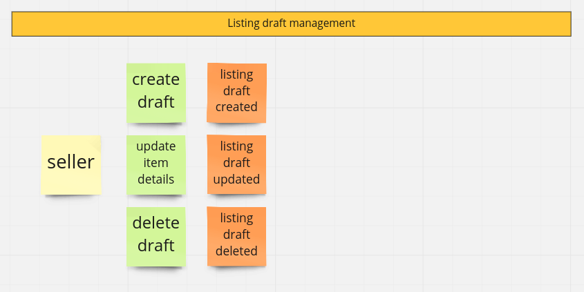
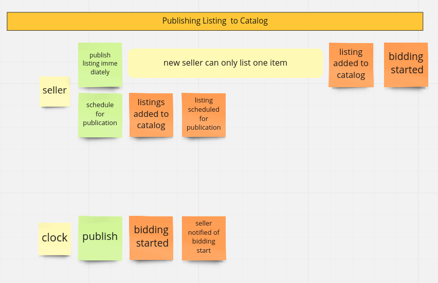
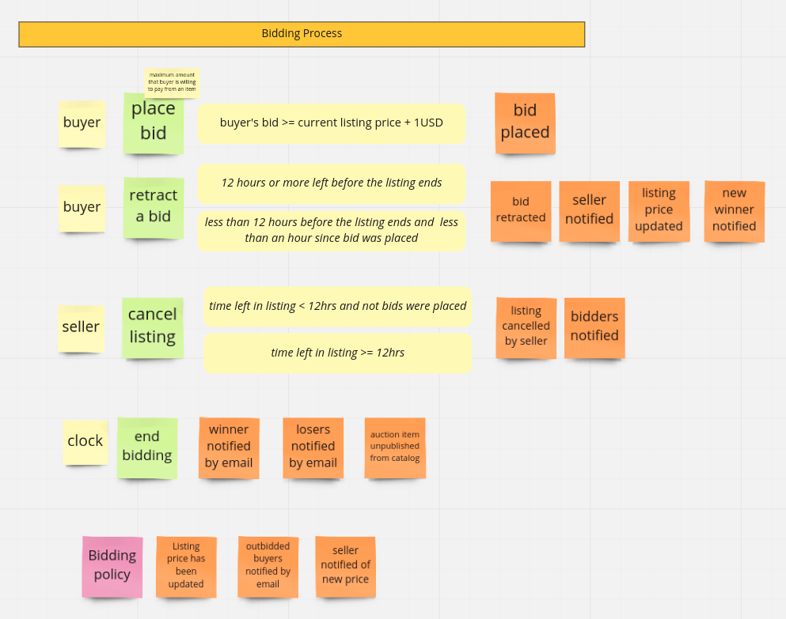
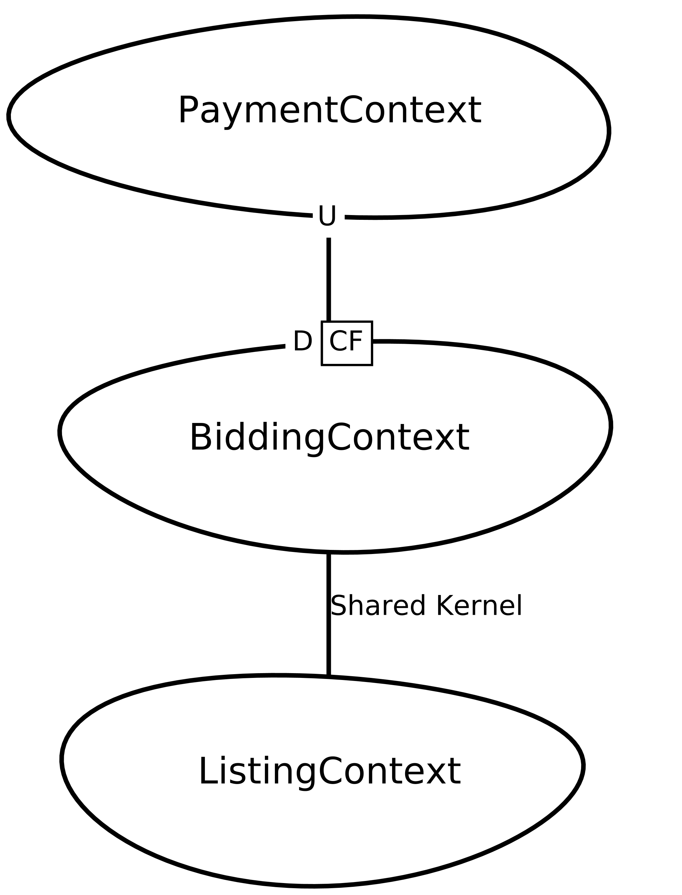

# Python Domain Driven Design (DDD) example project

Disclaimer: this is a work in progress project, stay tuned for updates.

## The goal of this project

AUCTION APPLICATION

The goal is to implement an automatic bidding system using DDD tactical patterns, 
described here: https://www.ebay.co.uk/pages/help/buy/bidding-overview.html

## Domain

Online Auctions domain was selected for the purpose of this project, which is loosely based on Ebay bidding system.

The main reason for selecting this domain is general familiarity and limited complexity - many people understand how internet bidding work and the whole concept is not difficult to understand (or at least it's much simpler that healthcare or banking domains). On the other hand it's not simply a CRUD system - there are some business rules that must be implemented in the system.

### Domain description

This is a summary of the information we got from a domain expert about how the auction system should work.

#### Selling

When you want to sell an item, the first step in getting your item in front of buyers is creating a `Listing`. For now we only focus on selling through auctions (https://www.ebay.com/help/selling/listings/auction-format?id=4110), but in the future we may consider selling with "Buy It Now" (https://www.ebay.com/help/selling/listings/selling-buy-now?id=4109) or in some other ways. When presenting an `Listing` for sale (which we call `publishing` in the Catalog), seller must provide a `Listing` duration and initial price. Also it is also possible to schedule a `Listing` publication (https://www.ebay.com/help/selling/listings/selecting-listing-duration?id=4652).

You can cancel your listing when bidding takes place, but only under certain circumstances: if time left in listing < 12 hrs you can cancel your listing only if no bids were places (but we might change it in the future).

If you are a new seller (you never sold an item before), you can list only one `Item` in the `Catalog` at a time.

#### Buying

When `Listing` is selled through auction `Bidding` takes place. As a `Buyer`, you can place a bid, which must be greated than the current price + 1 USD and which sets the the highest price you are willing to pay for an item. System will let you know if someone outbids you and you can decide if you want to increase your maximum limit. Sometimes you can can be automatically outbidded (if some other buyer sets his maximum limit higher that yours) - see https://www.ebay.com/help/buying/bidding/automatic-bidding?id=4014.

After a fixed time since the bidding was started a bidding ends and the `Winner` is announced. 

#### Payments

At this point, payments are out of scope for this project.

#### Users

Each user can be a `Seller` or a `Buyer` (or both). User priveledges can be elevated to a `Staff member` or `Administrator`.

## Event storming

Event storming technique was used to discover the business domain and the most important business processes.

### Listing draft management

### Publishing Listing  to Catalog

### Bidding process

## Context Map

`Lising`, `Bidding` and `Payment` bounded contexts were identified as a result of event storming. Relationship between these bounded contexts is presented in the following context map.

Since `Payment` context will be provided by a 3rd party payments provider (via REST API), the downstream context (`Bidding`) must conform to whatever the upstream provides.
